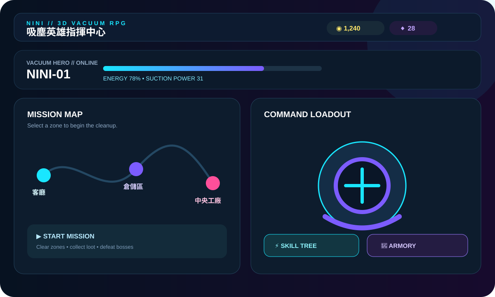
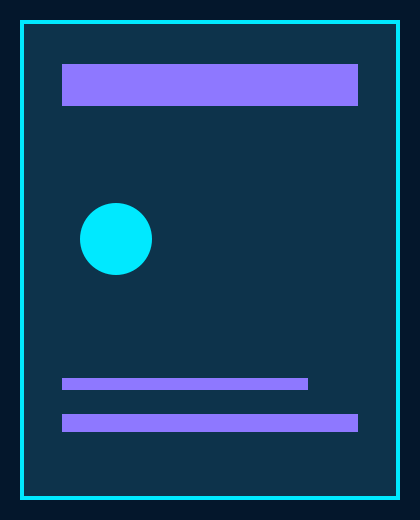

# 🧹 NINI // 3D Vacuum RPG

  

  <a href="#english">English</a> · <a href="#中文版">中文版</a>

  
  
  
  

## 🇬🇧 English

### What is NINI?

NINI is a neon sci-fi **3D vacuum RPG** built with SwiftUI and SceneKit. Become a vacuum commander, clean corrupted factory zones, upgrade your machine, unlock abilities, and defeat dust monsters. 🌀

### ✨ Highlights

- 🗺️ **Mission map** — clear zones from the living room to the central factory.
- 🧰 **Vacuum armory** — improve motor power, tank capacity, battery, and engine speed.
- ⚡ **Skill tree** — unlock Dash, Vortex, and UV Ray abilities.
- 🎮 **3D missions** — move, vacuum enemies, collect resources, and fight bosses.
- 📖 **Monster codex** — track dust, scrap, oil, and boss encounters.
- 🔊 **Reactive audio** — procedural background music and sound effects for each state.
- 💾 **Persistent progress** — upgrades, rank, rewards, and discoveries are saved locally.

### 🕹️ How to play

1. Choose an unlocked zone from **Command Center**.
2. Move the vacuum with the on-screen controls.
3. Collect resources and eliminate dust monsters.
4. Finish the mission to earn credits, gems, and XP.
5. Spend rewards in **Armory** and **Skills**, then take on the next zone.

### 📸 Preview

  

### 🎬 Operation demo

  

### 🧱 Built with

| Area | Technology |
| --- | --- |
| UI | SwiftUI |
| 3D gameplay | SceneKit |
| Audio | AVFoundation |
| State | Observation + UserDefaults |
| Minimum target | iOS 27 |

### 🚀 Run locally

1. Open the project in Xcode.
2. Select the `mynini` scheme and an iOS 27+ simulator.
3. Build and run with **⌘R**.
4. Choose a zone and start cleaning.

---

## 🇹🇼 中文版

### NINI 是什麼？

NINI 是一款霓虹科幻風格的 **3D 吸塵器 RPG**，以 SwiftUI 與 SceneKit 打造。化身吸塵英雄指揮官，清理被污染的工廠區域、強化裝備、解鎖技能，最後擊敗塵怪魔王。🌀

### ✨ 特色

- 🗺️ **任務地圖**：從客廳一路清理到中央工廠。
- 🧰 **吸塵器工坊**：升級馬達、集塵槽、電池與引擎速度。
- ⚡ **核心技能樹**：解鎖衝刺、漩渦吸力與 UV 光線。
- 🎮 **3D 任務玩法**：移動、吸取敵人、收集資源並挑戰 Boss。
- 📖 **塵怪圖鑑**：記錄灰塵怪、鐵屑蟲、毒油怪與 Boss 戰績。
- 🔊 **即時音效**：依照基地、關卡與 Boss 狀態切換程序化音樂。
- 💾 **本機存檔**：等級、升級、獎勵與圖鑑進度都會保留。

### 🕹️ 操作方式

1. 在 **指揮中心** 選擇已解鎖的區域。
2. 使用畫面上的控制器移動吸塵器。
3. 收集資源並消滅塵怪。
4. 完成任務，獲得金幣、寶石與經驗值。
5. 到 **吸塵器工坊** 與 **核心技能** 使用獎勵，再挑戰下一區。

### 📸 App 截圖

  

### 🎬 操作 GIF

  

### 🧱 使用技術

| 領域 | 技術 |
| --- | --- |
| 介面 | SwiftUI |
| 3D 遊戲 | SceneKit |
| 音效 | AVFoundation |
| 狀態管理 | Observation + UserDefaults |
| 最低版本 | iOS 27 |

### 🚀 本機執行

1. 使用 Xcode 開啟專案。
2. 選擇 `mynini` scheme 與 iOS 27+ 模擬器。
3. 按下 **⌘R** 建置並執行。
4. 選擇區域，開始清理任務。

  Made with 🧹, ⚡, and a little bit of dust.

